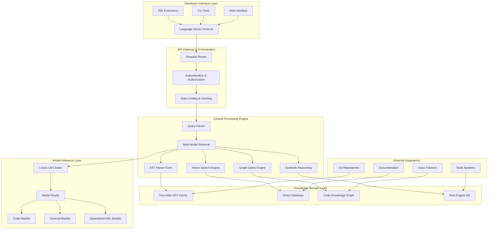

# Language-Agnostic Context Engine for Autonomous SDLC Agents: Technical Research Dossier

## Executive Summary

This research examines the technical foundations for building production-grade, language-agnostic context engines targeting autonomous software development lifecycle (SDLC) agents, with emphasis on hybrid approaches combining Abstract Syntax Tree (AST) parsing, vector embeddings, and symbolic reasoning. The analysis reveals that leading tools like Cline, Cursor, Continue.dev, and Aider employ sophisticated multi-modal context strategies, while academic research demonstrates significant advances in neurosymbolic approaches and code representation learning. 

Key findings indicate that Tree-sitter-based AST parsing provides the structural foundation for language-agnostic processing across 100+ programming languages, while GraphCodeBERT and similar models enable semantic understanding through vector embeddings. Hybrid RAG systems combining these approaches show 18.9% performance improvements over single-modality methods. For specialized domains like Verilog/SystemVerilog, tools like Verible and Surelog offer IEEE-compliant parsing with sophisticated hierarchy analysis capabilities.

The research identifies mature open-source components including Weaviate/Chroma for vector storage, vLLM/Ollama for local LLM inference, and comprehensive security frameworks (MITRE ATLAS, NIST AI RMF) for enterprise deployment. Critical architectural decisions involve balancing context relevance against token window limitations, implementing incremental parsing for large codebases, and ensuring robust privacy controls for proprietary semiconductor intellectual property.

## Problem Definition & Requirements

### Core Technical Challenges

Modern autonomous SDLC agents require sophisticated context understanding across multiple dimensions: **syntactic structure** (AST relationships), **semantic meaning** (natural language alignment), **cross-file dependencies** (import graphs), and **domain-specific constraints** (timing in hardware, business logic in enterprise software). Traditional approaches fail at scale due to context window limitations, language-specific parsing complexity, and inadequate multi-modal integration.

### Functional Requirements

**Language Coverage**: The context engine must support general-purpose languages (Python, Java, TypeScript/Angular) and specialized hardware description languages (Verilog, SystemVerilog) through unified parsing infrastructure. **Scale Requirements**: Processing codebases exceeding 100,000 lines of code with subsecond response times for context retrieval. **Accuracy Requirements**: Context relevance scores above 0.85 NDCG@10 for code search and completion tasks.

**Privacy Requirements**: Complete air-gapped operation with zero external dependencies, cryptographic protection of proprietary IP, and comprehensive audit trails for compliance frameworks including ITAR and semiconductor export controls. **Integration Requirements**: RESTful APIs compatible with existing development environments, Language Server Protocol (LSP) support, and seamless integration with git workflows.

### Non-Functional Requirements

**Performance**: Context retrieval latency under 100ms for typical queries, support for concurrent users (50+ developers), and efficient incremental updates for modified files. **Reliability**: 99.9% availability with graceful degradation, automated failure recovery, and comprehensive monitoring. **Maintainability**: Modular architecture enabling component updates, comprehensive API documentation, and established upgrade procedures.

## Survey of Existing Solutions

### Comparative Analysis Framework

| Tool | Context Strategy | AST Integration | Vector Embeddings | Local Deployment | Language Support | Open Source |
|------|------------------|-----------------|------------------|-------------------|------------------|-------------|
| **Cline** | Multi-modal AST + Regex | Tree-sitter | Semantic search | Hybrid | Language-agnostic | Yes |
| **Cursor** | Custom retrieval models | Proprietary | Advanced embedding | Standalone IDE | 40+ languages | No |
| **Continue.dev** | Building blocks framework | Configurable | RAG integration | Full local support | Configurable | Yes (Apache 2.0) |
| **Aider** | Git-native ctags mapping | Universal ctags | Repository-wide | Local analysis | 40+ languages | Yes |
| **Tabby** | RAG with Tree-sitter | AST parsing | Documentation integration | Self-hosted | 40+ languages | Yes |

### Deep Analysis: Most Promising Solutions

#### Continue.dev: Modular Open-Source Framework

**Architecture Excellence**: Continue.dev implements a sophisticated **building blocks architecture** separating context into seven distinct components: Models, Context Providers, Documentation, MCP Servers, Rules, Prompts, and Data. This modularity enables precise customization for enterprise requirements while maintaining interoperability across development environments.

**Technical Implementation**: The framework employs **extensible context providers** supporting @file, @folder, @issue, @google references with custom source integration. RAG patterns provide context-aware code generation, while rules-based context delivers persistent project-specific guidance. The Hub system enables centralized sharing of custom assistants and components.

**Strengths**: Maximum customization capability, transparent Apache 2.0 licensed architecture, robust community ecosystem, and comprehensive model integration supporting OpenAI, Anthropic, local models, and custom endpoints. **Limitations**: Requires significant setup complexity compared to turnkey solutions, demanding DevOps expertise for optimal deployment.

#### Aider: Git-Native Symbol-Based Context Engine

**Revolutionary Context Approach**: Aider pioneered **repository mapping** through universal ctags integration, creating comprehensive codebase representations within LLM token constraints. This approach extracts function signatures, class definitions, and variable declarations while maintaining structural relationships across files.

**Technical Innovation**: The ctags-powered context system provides GPT models with structured codebase understanding, enabling intelligent file selection for modifications. Git integration leverages version history and file relationships for enhanced context relevance, while automatic commit generation maintains development workflow integrity.

**Performance Characteristics**: Scales effectively to enterprise codebases through efficient symbol-based representation. Terminal-native workflow integrates seamlessly with existing development practices. **Limitations**: Command-line interface limits accessibility, requires API keys increasing operational costs, and lacks IDE integration.

#### Tabby: Self-Hosted RAG System

**Privacy-First Architecture**: Tabby delivers complete **data sovereignty** through self-hosted deployment with GPU optimization and enterprise-ready user management. Tree-sitter integration provides structural code comprehension while the Answer Engine integrates seamlessly with internal documentation systems.

**Enterprise Features**: LDAP authentication, comprehensive audit logs, and OpenAPI interfaces enable enterprise integration. Docker containerization simplifies deployment while GPU support ensures optimal performance for large teams. **Scalability**: Designed specifically for team deployments with sophisticated user management and access controls.

**Strategic Value**: Addresses critical enterprise requirements around intellectual property protection and compliance frameworks while maintaining high performance through local GPU acceleration.

### Additional Notable Solutions

**Cursor** provides the most polished IDE experience through proprietary custom retrieval models and semantic code search, though transparency limitations restrict enterprise adoption. **GitHub Copilot** offers mature ecosystem integration with recent Copilot Spaces functionality for curated knowledge bundles, but limited context management capabilities constrain large codebase effectiveness.

## Techniques & Design Patterns

### Tree-Sitter AST Slicing and Language-Agnostic Processing

**Technical Foundation**: Tree-sitter provides incremental parsing capabilities designed for real-time code analysis with **36x performance improvements** over traditional parsers like JavaParser. The grammar-based approach enables consistent parsing across 100+ programming languages through language-agnostic specifications.

**Advanced AST Manipulation**: Tools like **ast-grep** implement jQuery-like APIs for AST traversal with isomorphic pattern matching, enabling code searches written in natural syntax rather than complex query languages. Multi-core Rust implementation provides enterprise-scale performance for large codebases.

**Implementation Patterns**: Universal ctags integration extracts structural elements (functions, classes, variables) while preserving cross-file relationships. Incremental parsing enables real-time updates supporting keystroke-level responsiveness in development environments. **Performance**: Tree-sitter's zero-dependency C runtime ensures minimal resource overhead while maintaining robust error recovery with incomplete code.

### Vector + Graph Hybrid RAG Systems

**Academic Foundations**: Research demonstrates **18.9% performance improvements** through hybrid approaches combining vector similarity search with graph-based structural understanding. GraphCodeBERT pioneered integration of data flow graphs with traditional AST representations, enabling semantic-level relationship modeling beyond syntactic patterns.

**CodeGRAG Framework**: Recent research introduces graphical RAG frameworks combining control flow and data flow analysis through hard meta-graph prompt templates and soft prompting with Graph Neural Network (GNN) expert models. GraphEmb encoding with alignment and structure-preserving objectives enables robust code understanding across programming languages.

**Technical Implementation**: Hybrid systems employ **contextual multi-armed bandits** for adaptive retrieval selection, dynamically choosing between vector similarity and graph traversal based on query characteristics. Multi-retriever architectures with prompt-based semantic understanding achieve significant improvements in code completion accuracy.

### Neurosymbolic Indexing and Knowledge Integration

**Conceptual Framework**: Neurosymbolic approaches combine symbolic reasoning capabilities with neural representation learning, addressing limitations of pure embedding-based systems. Research taxonomy identifies three primary approaches: logically-informed embeddings, embedding approaches with logical constraints, and rule learning systems.

**Program Analysis Integration**: Static analysis techniques including Control Flow Graphs (CFG) and data flow analysis integrate seamlessly with neural networks for enhanced code understanding. Symbolic execution with ML guidance enables sophisticated path exploration and bug detection capabilities.

**Knowledge Graph Construction**: Code entities (functions, classes, variables) form knowledge graph nodes with relationships representing calls, inheritance, and dependencies. Logical constraints and inference rules enable sophisticated reasoning about code behavior and architectural patterns.

### Language-Agnostic Tokenization Strategies

**Universal Tokenizer Architecture**: Modern approaches employ **tokenizers-cpp** providing universal C++ bindings for HuggingFace tokenizers and SentencePiece, enabling cross-platform deployment including WebAssembly and mobile environments. Blob-based loading with minimal dependencies simplifies integration across development platforms.

**Cross-Language Challenges**: Multi-language parsing requires automatic language detection, mixed-language support (HTML + JavaScript, Markdown + code blocks), and tokenization consistency across programming paradigms. BPE (Byte-Pair Encoding) and SentencePiece provide language-independent subword tokenization addressing these challenges.

**Implementation Excellence**: Universal interfaces enable single tokenizer deployment across multiple programming languages while maintaining performance characteristics. API boundary detection and type system mapping enable sophisticated cross-language dependency analysis for polyglot codebases.

### Specialized Verilog/SystemVerilog Handling

**IEEE Compliance Challenges**: SystemVerilog's IEEE 1800-2017 specification presents exceptional parsing complexity through extensive syntax including interfaces, classes, assertions, and verification constructs. Preprocessing integration with macro systems and conditional compilation fundamentally alters code structure during analysis.

**Open-Source Solutions**: **Verible** (ChipsAlliance) provides comprehensive SystemVerilog toolchain with parser, linter, formatter, and language server capabilities. **Surelog/UHDM** stack offers full IEEE compliance with Universal Hardware Data Model output enabling tool interoperability. **sv-parser** (Rust) delivers high-performance parsing with clean API design.

**Context-Specific Requirements**: HDL parsing must understand concurrent hardware behavior, timing relationships, clock domains, and module hierarchy relationships. Parameter propagation through instantiation hierarchies affects synthesis and timing analysis, requiring sophisticated dependency tracking beyond traditional software development patterns.

**Performance Optimization**: Large SoC designs exceeding 100 million gates require multi-threaded parsing with sophisticated caching strategies. Incremental compilation support proves essential for team productivity on enterprise-scale semiconductor projects.

## Proposed High-Level Architecture

### Core System Design

### Core Modules Architecture

**Request Processing Pipeline**: API Gateway implements OpenAI-compatible endpoints with comprehensive authentication, rate limiting, and request validation. Query Parser analyzes incoming requests to determine optimal retrieval strategy, routing between AST-based structural queries, semantic similarity search, or hybrid approaches.

**Multi-Modal Retrieval Engine**: Parallel processing across AST Parser Farm (Tree-sitter instances), Vector Search Engine (Weaviate/Chroma), Graph Query Engine (Neo4j/Neptune), and Symbolic Reasoning components. **Contextual scoring algorithms** rank and merge results from multiple modalities based on query characteristics and user context.

**Knowledge Management System**: Incremental indexing pipeline maintains synchronized representations across storage layers. AST Cache provides real-time structural analysis, Vector Database stores semantic embeddings, Code Knowledge Graph captures relationships and dependencies, while Rule Engine DB maintains domain-specific logic and constraints.

### Open-Source Stack Recommendations

**Core Infrastructure Components**:
- **Container Orchestration**: Kubernetes with NVIDIA GPU Operator for ML workloads
- **API Gateway**: Kong or Istio Service Mesh for traffic management and security
- **Message Queue**: Apache Kafka for asynchronous processing and event streaming
- **Monitoring**: Prometheus + Grafana + OpenTelemetry for comprehensive observability

**ML/AI Stack**:
- **Local LLM Serving**: vLLM or Text Generation Inference (TGI) with Llama 3.1/CodeLlama models
- **Vector Database**: Weaviate for production deployment, Chroma for development environments
- **Graph Database**: Neo4j Community Edition or Amazon Neptune (self-hosted)
- **AST Processing**: Tree-sitter with language-specific grammars, ast-grep for pattern matching

**Development & Deployment**:
- **CI/CD Pipeline**: GitLab CI or GitHub Actions with comprehensive testing framework
- **Container Registry**: Harbor for secure image storage and vulnerability scanning
- **Secrets Management**: HashiCorp Vault for API keys and encryption keys
- **Backup & Recovery**: Velero for Kubernetes-native backup solutions

### Deployment Topology

**High Availability Configuration**: Multi-zone deployment with automated failover, load balancing across GPU-enabled nodes, and persistent volume storage for model weights and indices. **Horizontal scaling** through Kubernetes Horizontal Pod Autoscaler based on GPU utilization and request latency metrics.

**Resource Allocation**: Dedicated node pools for different workload types (CPU-intensive AST parsing, GPU-intensive LLM inference, memory-intensive vector search). **Batch processing capabilities** for repository indexing and model fine-tuning tasks during off-peak hours.

## Privacy & Compliance Notes

### Proprietary Semiconductor IP Protection

**Data Sovereignty Architecture**: Complete air-gapped deployment eliminates external dependencies and ensures intellectual property remains within organizational boundaries. **Cryptographic protection** through AES-256 encryption for data at rest and TLS 1.3 for internal communications provides defense against unauthorized access.

**Access Control Framework**: Role-Based Access Control (RBAC) with multi-factor authentication ensures granular permissions management across design teams. **Audit logging** captures all system interactions with immutable timestamps for compliance verification and forensic analysis.

**IP Obfuscation Capabilities**: Integration with tools like Verible's obfuscator replaces identifiers while preserving structural relationships necessary for context analysis. **Geofencing controls** implement location-based access restrictions supporting ITAR compliance and export control requirements.

### Air-Gapped Workflow Implementation

**Network Isolation Requirements**: Complete physical separation from internet-connected networks with dedicated internal infrastructure supporting high-speed (10+ Gbps) connectivity between development workstations and context engines. **Local container registry** and artifact storage eliminate external dependencies during operation.

**Operational Security**: **Hardware Security Modules (HSMs)** or dedicated key management systems protect encryption keys and authentication tokens. **Vulnerability management** through offline security update procedures and isolated vulnerability scanning infrastructure.

**Compliance Integration**: Automated compliance reporting supporting SOC 2, ISO 27001, and industry-specific requirements. **Data loss prevention (DLP)** mechanisms prevent unauthorized data exfiltration through comprehensive network monitoring and endpoint protection.

### Enterprise Security Framework

**MITRE ATLAS Integration**: Systematic mapping of AI-specific threats including model extraction, prompt injection, and data poisoning attacks. **Adversarial training** improves model resilience against sophisticated attack techniques while maintaining functionality.

**Zero Trust Architecture**: Every request undergoes verification regardless of source location, implementing comprehensive identity verification and authorization. **Continuous monitoring** through Security Information and Event Management (SIEM) systems provides real-time threat detection and incident response capabilities.

## Future-Proofing & Evergreen Update Loop

### Adaptive Architecture Principles

**Model Evolution Support**: Plugin architecture enables seamless integration of new LLM architectures and specialized models without requiring core system modifications. **Version management systems** support A/B testing of model updates and automated rollback capabilities for performance regression scenarios.

**Technology Integration Readiness**: **Modular component design** facilitates integration of emerging technologies including advanced reasoning models, multimodal understanding capabilities, and novel neural architectures. **API versioning strategy** ensures backward compatibility during system evolution.

### Continuous Improvement Framework

**Performance Monitoring Pipeline**: Comprehensive metrics collection covering context relevance (NDCG@k), response latency, model accuracy, and user satisfaction scores. **Automated benchmarking** against established code understanding datasets provides objective performance tracking over time.

**Community Integration Strategy**: **Open-source contribution workflow** enables integration of community improvements while maintaining security and stability requirements. **Research collaboration** with academic institutions provides early access to breakthrough techniques and methodologies.

**Update Distribution System**: **Staged deployment pipeline** supports gradual rollout of updates across development teams with comprehensive testing and validation procedures. **Rollback mechanisms** ensure rapid recovery from problematic updates while minimizing disruption to development workflows.

## Annotated Reading List

### Academic Research & Foundations

**Code Understanding & Context Management**
- Abstract Syntax Tree for Programming Language Understanding: https://arxiv.org/html/2312.00413v1 - Comprehensive evaluation of AST parsing methods across programming languages
- Heterogeneous Directed Hypergraph Neural Network over AST: https://arxiv.org/abs/2305.04228 - Advanced AST representation using hypergraph structures
- CodeGRAG: Bridging Natural Language and Programming via Graphical RAG: https://arxiv.org/abs/2405.02355 - Hybrid graphical retrieval augmented generation framework
- Prompt-based Code Completion via Multi-Retrieval Augmented Generation: https://arxiv.org/html/2405.07530v1 - Multi-retriever systems with contextual bandits

**Large Language Models for Code**
- Survey on Large Language Models for Software Engineering: https://arxiv.org/html/2312.15223v2 - Comprehensive analysis of 100+ code LLMs from 2020-2024
- CodeRAG-Bench: Can Retrieval Augment Code Generation?: https://arxiv.org/html/2406.14497v2 - Systematic evaluation framework for retrieval-augmented code generation

**Neurosymbolic AI & Hybrid Systems**
- Neurosymbolic AI for Reasoning over Knowledge Graphs: https://arxiv.org/abs/2302.07200 - Survey of neurosymbolic approaches for structured reasoning

### Tools & Implementation Resources

**Open-Source Context Engines**
- Continue.dev Framework: https://github.com/continuedev/continue - Modular open-source framework with building blocks architecture
- Continue.dev Hub: https://hub.continue.dev/ - Centralized sharing platform for custom assistants and components
- Continue.dev Documentation: https://docs.continue.dev/ - Comprehensive implementation guides and API references

**Advanced Code Analysis Tools**
- Cline (Claude Dev): https://github.com/cline/cline - Agentic multi-modal system with MCP integration
- Cline Documentation: https://cline.bot/ - User guides and architectural documentation
- Aider Repository: https://github.com/Aider-AI/aider - Git-native RAG system with ctags integration
- Aider ctags Technical Details: https://aider.chat/docs/ctags.html - Repository mapping implementation guide

**Self-Hosted AI Infrastructure**
- Tabby Self-Hosted AI Coding Assistant: https://github.com/TabbyML/tabby - Complete self-hosted solution with Tree-sitter integration
- Tabby Documentation: https://tabby.tabbyml.com/docs/ - Deployment and configuration guides
- Ollama Local LLM Framework: https://github.com/ollama/ollama - Lightweight local LLM deployment solution

### Technical Implementation Components

**AST Processing & Language Support**
- Tree-sitter Parser Generator: https://github.com/tree-sitter/tree-sitter - Incremental parsing library for 100+ languages
- ast-grep Pattern Matching: https://github.com/ast-grep/ast-grep - jQuery-like API for AST traversal and transformation
- code_ast Python Wrapper: https://github.com/cedricrupb/code_ast - Simplified interface over tree-sitter complexity

**Vector Databases & Embedding Systems**
- Weaviate Vector Database: https://github.com/weaviate/weaviate - Production-ready vector database with GraphQL API
- Chroma AI-Native Database: https://github.com/chroma-core/chroma - Developer-friendly vector database for LLM applications
- Milvus Distributed Vector Database: https://github.com/milvus-io/milvus - High-performance distributed vector database
- Qdrant Vector Search Engine: https://github.com/qdrant/qdrant - Rust-based vector database with advanced filtering

**LLM Serving & Inference**
- vLLM High-Throughput Inference: https://github.com/vllm-project/vllm - Production-scale LLM inference engine
- Text Generation Inference: https://github.com/huggingface/text-generation-inference - Hugging Face's optimized inference server
- OpenLLM Enterprise Platform: https://github.com/bentoml/OpenLLM - Enterprise-focused LLM serving with OpenAI compatibility

### Hardware & Specialized Language Support

**SystemVerilog & HDL Tools**
- Verible SystemVerilog Suite: https://github.com/chipsalliance/verible - Comprehensive IEEE-compliant toolchain
- sv-parser Rust Implementation: https://github.com/dalance/sv-parser - High-performance SystemVerilog parser
- Surelog Full Preprocessor: https://github.com/chipsalliance/Surelog - Complete SystemVerilog 2017 compliance with UHDM
- slang SystemVerilog Compiler: https://sv-lang.com/parsing.html - Robust parser designed for editing scenarios

**Semiconductor Industry Resources**
- ChipsAlliance Open Hardware: https://chipsalliance.org/ - Industry consortium for open-source EDA tools
- EDA Playground Web Platform: https://www.edaplayground.com/ - Online HDL simulation and synthesis platform

### Security & Enterprise Deployment

**AI Security Frameworks**
- MITRE ATLAS Navigator: https://github.com/mitre-atlas/atlas-navigator - AI threat landscape knowledge base
- OWASP Top 10 for LLM Applications: https://owasp.org/www-project-top-10-for-large-language-model-applications/ - Critical security risks for LLM systems
- NIST AI Risk Management Framework: https://www.nist.gov/itl/ai-risk-management-framework - Comprehensive AI governance framework

**Container Orchestration & DevOps**
- KubeFlow ML Workflows: https://github.com/kubeflow/kubeflow - End-to-end ML pipeline management
- Ray Distributed Computing: https://github.com/ray-project/ray - Scalable distributed computing for ML workloads
- NVIDIA GPU Operator: https://github.com/NVIDIA/gpu-operator - Kubernetes GPU scheduling and management
- ArgoCD GitOps: https://github.com/argoproj/argo-cd - Declarative continuous deployment for Kubernetes

**Enterprise Security & Compliance**
- HashiCorp Vault: https://github.com/hashicorp/vault - Secrets management and encryption as a service
- Self-Hosting Comprehensive Guide: https://github.com/mikeroyal/Self-Hosting-Guide - Complete self-hosting reference
- Kubernetes Security Documentation: https://kubernetes.io/docs/concepts/security/ - Container orchestration security best practices

### Research & Community Resources

**Academic Venues & Conferences**
- Papers with Code: https://paperswithcode.com/task/code-generation - Comprehensive code generation research repository
- Association for Computational Linguistics: https://aclweb.org/ - Premier NLP/AI conference proceedings
- International Conference on Software Engineering: https://conf.researchr.org/series/icse - Software engineering research venue

**Community Discussion & Learning**
- r/MachineLearning: https://reddit.com/r/MachineLearning - Academic and industry ML discussions
- r/LocalLLaMA: https://reddit.com/r/LocalLLaMA - Self-hosted LLM community and resources
- r/ProgrammingLanguages: https://reddit.com/r/ProgrammingLanguages - Language design and implementation discussions
- r/FPGA: https://reddit.com/r/FPGA - Hardware description language and FPGA development community
- r/semiconductors: https://reddit.com/r/semiconductors - Semiconductor industry discussions and technology trends

This comprehensive technical research dossier provides the foundational knowledge and practical guidance necessary for implementing a production-grade, language-agnostic context engine supporting both general software development and specialized semiconductor design workflows.